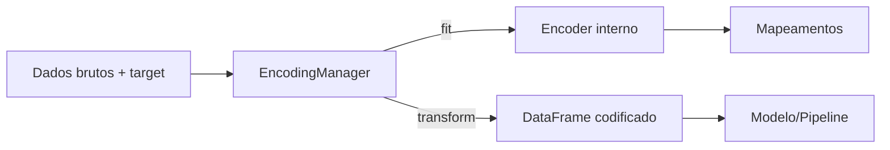

<p align="center">
  
</p>

# 🧮 WOEGuard

Transforme variáveis categóricas usando **Weight of Evidence (WoE)** com suporte a:

- Criação de novas colunas codificadas com sufixo `_woe`
- Exportação e importação via `.json` para reuso em produção
- Cálculo de Information Value (IV)
- Compatível com `scikit-learn` Pipelines
- Tratamento auditável de valores ausentes
- Visualização com gráficos e exportação de relatórios `.xlsx`

---

## 🚀 Exemplo Rápido

```python
from woe_guard import WOEGuard

# Ajustar encoder
encoder = WOEGuard(categorical_cols=['uf', 'produto'])
encoder.fit(df[['uf', 'produto']], df['target'])

# Aplicar transformação
df_w = encoder.transform(df)

# Salvar log em JSON
encoder.export_log("woe_log.json")

# Reusar em produção
novo_encoder = WOEGuard.load_from_json("woe_log.json")
df_novo = novo_encoder.transform(novo_df)
```

---

## 🔄 Fluxo de Processamento



---

## 📒 API Reference

| Método                  | Descrição                                                           |
|-------------------------|---------------------------------------------------------------------|
| `fit(X, y)`             | Ajusta o encoder com base nas colunas categóricas e target binário. |
| `transform(X)`          | Cria novas colunas com o sufixo `_woe`.                             |
| `fit_transform(X, y)`   | Executa `fit` e `transform` juntos.                                 |
| `summary(path=None)`    | Exporta um DataFrame com WoE, IV e categorias.                      |
| `plot_woe(feature)`     | Plota gráfico horizontal de WoE por categoria.                      |
| `view_log()`          | Retorna o dicionário interno com os mapeamentos WoE.                |
| `export_log(path)` | Salva `woe_log_` e `iv_log_` em JSON.                               |
| `load_from_json(path)`  | Cria um novo encoder pronto para `transform()` com base em um JSON. |
| `save(path)`            | Salva o encoder inteiro em formato `pickle`.                        |
| `load(path)`            | Carrega um encoder previamente salvo via `save`.                    |

---

## ⚙️ Parâmetros de Configuração

| Parâmetro          | Tipo        | Descrição                                                                    |
|--------------------|-------------|------------------------------------------------------------------------------|
| `categorical_cols` | `List[str]` | Lista das colunas categóricas a codificar.                                   |
| `drop_original`    | `bool`      | Remove colunas originais após transformação (default: `False`).              |
| `suffix`           | `str`       | Sufixo das novas colunas WoE (default: `_woe`).                              |
| `alpha`            | `float`     | Suavização de Laplace para evitar log(0) (default: `0.5`).                   |
| `default_woe`      | `float`     | Valor WoE a aplicar para categorias não vistas (default: `0.0`).             |
| `include_nan`      | `bool`      | Trata `NaN` como categoria separada chamada `"__nan__"` (default: `True`). |

---

## 📤 Exportação e Reuso via JSON

```python
# Exportar
encoder.export_log("woe_log.json")

# Reutilizar depois
encoder_reusado = WOEGuard.load_from_json("woe_log.json")
encoder_reusado.transform(novo_dataframe)
```

---

## 📚 Exemplos de Uso

Scripts completos estão disponíveis em [`src/examples`](src/examples):

- `simple_usage.py` – demonstra o ajuste e aplicação do `WOEGuard`.
- `pipeline_example.py` – constrói um pipeline de treinamento utilizando o `EncodingManager`.

Execute-os com:

```bash
python src/examples/simple_usage.py
python src/examples/pipeline_example.py
```

---

## 🤝 Contribuições

Contribuições são bem-vindas! Para sugerir melhorias:

1. Faça um fork do repositório
2. Crie um branch (`feature/nova-funcionalidade`)
3. Commit suas mudanças (`git commit -m '✨ adiciona nova funcionalidade'`)
4. Push para o branch (`git push origin feature/nova-funcionalidade`)
5. Abra um Pull Request
